# 팰월드 모작 (PalWorld Replica)
> **Unreal Engine 5와 C++를 활용하여 구현한 팰월드(PalWorld) 보스전 모작 3D 액션 프로젝트**

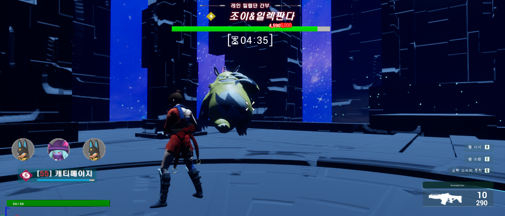

본 프로젝트는 팰월드의 핵심 플레이인 **보스 몬스터(그리즐볼트)전**을 재현하기 위해 팀원들과 협업하여 진행한 언리얼 엔진 5 기반 프로젝트입니다. 플레이어와 소환된 펠(Anubis 등)의 협동 전투를 목표로 설계되었으며, 보스의 동적 의사 결정 AI와 전투 흐름 설계를 총괄하였습니다.

---

## 🛠️ 개발 환경 및 사용 기술
- **Engine**: Unreal Engine 5.3+
- **Language**: C# (Unity 비교) / C++ (핵심 로직), Blueprint (애셋 맵핑 및 연출)
- **Design Pattern**: Component-Based FSM (유한 상태 머신), Observer 패턴 (Delegate 연동)
- **Physics**: Radial Force Component, Character Ragdoll, Collision Raycasting

---

## ✨ 담당 역할 & 핵심 구현 기술 (양원규)

프로젝트 내에서 **보스 캐릭터(그리즐볼트)의 상태 제어 컴포넌트(FSM) 설계, 동적 AI 포지셔닝 알고리즘, 그리고 이벤트 기반의 실시간 타겟 갱신 시스템**을 단독 설계 및 개발하였습니다.

### 1. 컴포넌트 기반 FSM 설계 (`UGrizzBoltActorComponent`)
- 보스 캐릭터 클래스(`AGrizzBolt`)의 가독성과 확장성을 위해 상태 제어 로직을 컴포넌트로 분리하는 **Component-Based Architecture**를 적용했습니다.
- 총 9가지 행동 상태(`IDLE`, `MOVE`, `SKILL1~4`, `DAMAGE`, `DIE`, `FINDTARGET`)를 매 프레임 안전하게 추적 및 전이하는 FSM 엔진을 구축하였습니다.

#### 📊 보스 FSM & 스킬 연동 플로우차트
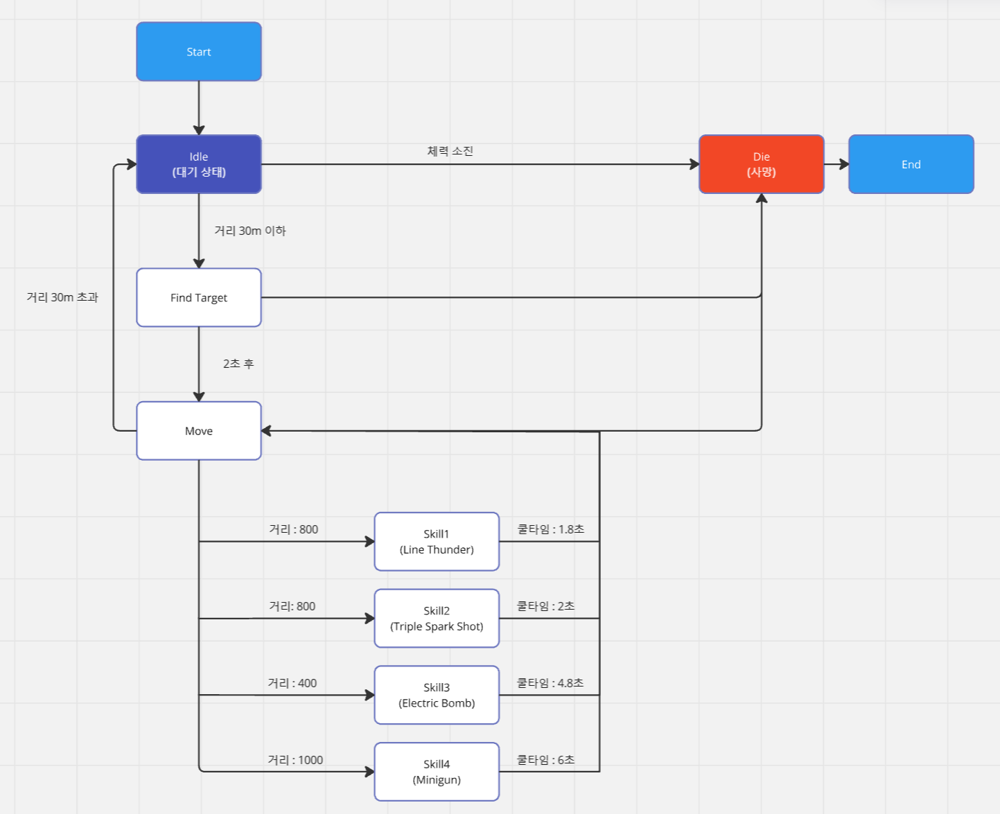

### 2. 거리 기반 동적 포지셔닝 AI 알고리즘 (`TickMove`)
단순히 유저를 향해 직선 돌진하는 단조로운 패턴을 탈피하기 위해, 타겟과의 거리 데이터를 세분화한 **의사 결정 트리**를 구축했습니다.
- **감지 및 타겟팅**: 감지 범위(`DetectionRange: 11000f`) 내 타겟 감지 시 이동을 개시하고, 유효 범위 밖으로 이탈 시 즉시 `IDLE` 상태로 복구됩니다.
- **무작위 콤보 공격**: 적정 사거리(`SkillDistance: 1500f`) 도달 시 무작위 확률 분기(`FMath::RandRange`)를 통해 쿨타임 기반의 3가지 스킬(라인 썬더, 트리플 스파크, 미니건 사격)을 유기적으로 발동합니다.
- **백스텝 및 회피 (Backstepping)**: 타겟과 초근접(`NearDistance: 300f` 이하) 시 타겟의 반대 방향 벡터(`-DirToTarget.GetSafeNormal()`)로 이동 입력을 주어 안전거리를 확보하는 회피 기동을 수행합니다. 
- **백스텝 연계 중거리 기믹**: 백스텝 도중 **1/5 확률**로 중거리(`MiddleDistance: 700f`)에서 회피를 긴급 제동하고, 타겟 방향으로 고개를 돌려 강력한 범위형 낙뢰 스킬(`SKILL3`)을 발동하도록 연계 패턴을 설계했습니다.

```cpp
// [구현 핵심] TickMove 중 일부 - 근접 시 백스텝 및 중거리 스킬 연계 로직
if (CachedDistanceToTarget <= NearDistance)
{
    if (!bIsBackingAway)
    {
        // 1/5 확률로 중거리(700f)에서 제동 후 Skill3 연계 설정
        bIsMovingToMiddleDistance = FMath::RandRange(0, 4) == 0; 
        bIsBackingAway = true;
    }
}

if (bIsBackingAway)
{
    FVector MoveBackDirection = -DirToTarget.GetSafeNormal();
    FRotator BackRotation = MoveBackDirection.Rotation();
    BackRotation.Pitch = FMath::Clamp(BackRotation.Pitch, -10.f, 25.f);
    Me->SetActorRotation(BackRotation);
    Me->AddMovementInput(MoveBackDirection); // 반대 방향 회피 이동

    if (bIsMovingToMiddleDistance && CachedDistanceToTarget >= MiddleDistance)
    {
        // 중거리 도달 시 즉시 상태를 리셋하고 SKILL3 시퀀스 발동
        bIsBackingAway = false;
        CurrentState = EGrizzBoltState::SKILL3;
        TransitionToSkillState();
        return;
    }
}
```

### 3. 보스 전용 스킬 시스템 및 구현 코드
쿨타임 기반으로 보스의 4종 핵심 스킬을 동적 로딩하여 발동시킵니다.

#### 📊 보스 스킬 상세 정의
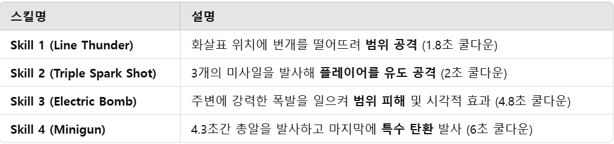

#### 🎮 개별 스킬 인게임 연출 및 코드
- **라인 썬더 & 트리플 스파크 & 일렉트릭 붐**
<p align="center">
  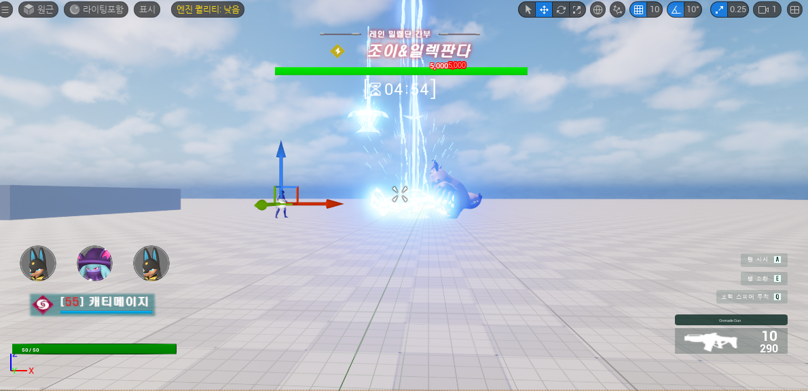
  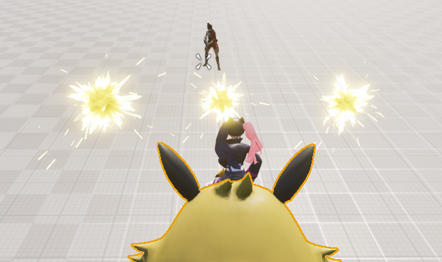
  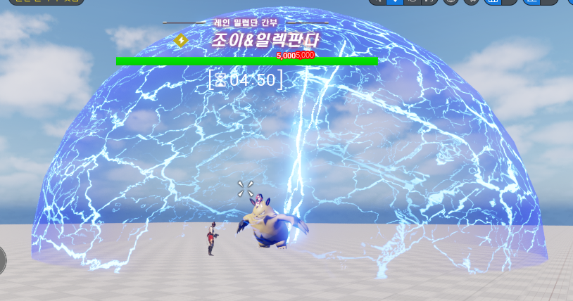
</p>

- **개틀링건 (미니건 사격 스킬 - C++ 연산 제어)**
  - 4.3초 동안 0.1초 주기로 일반 탄환(`AGrizzBullet`)을 사격한 후, 몽타주 종료 타이밍에 맞춰 피니시 특수 탄환(`SpawnGAP()`)을 사격하는 하이브리드 발사 루틴을 C++로 연산 처리했습니다.
<p align="center">
  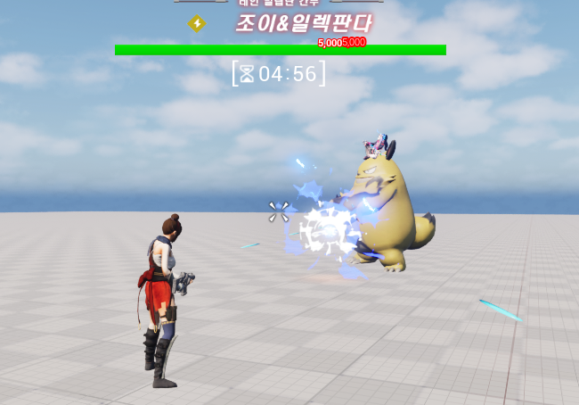
</p>

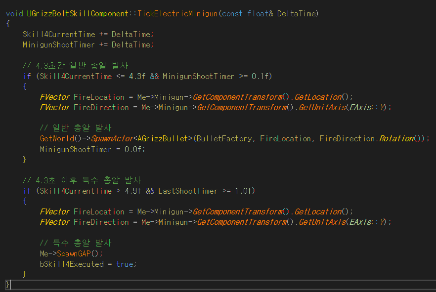

### 4. 멀티캐스트 델리게이트 연동 실시간 어그로(Aggro) 시스템 (`OnPalRetrieved`)
- 플레이어의 펠 소환/회수 델리게이트(`OnPalInteract`)에 보스 컴포넌트를 바인딩(`AddUObject`)하여 어그로 타겟을 실시간 자동 갱신.
- 소환된 펠이 사라지면 즉시 `FindTarget()`을 재호출하여 플레이어를 추적하게 함으로써 타겟 유실로 인한 AI 멈춤 현상을 원천 차단했습니다.

```cpp
void UGrizzBoltActorComponent::OnPalRetrieved(bool bIsSummon)
{
    if (!bIsSummon)
    {
        // 소환되어 있던 펠이 회수되면, 즉시 가장 가까운 다른 생존 대상을 찾아 타겟 갱신
        Target = Cast<ACharacter>(FindTarget());
    }
}
```

- **타겟 인식 시각 피드백 제공**: 보스가 타겟을 최초 인식했을 때 머리 위에 느낌표 마커 UI(`boss_detect_player.png`)를 스폰하여 유저에게 긴장감 있는 피드백을 전달합니다.
<p align="center">
  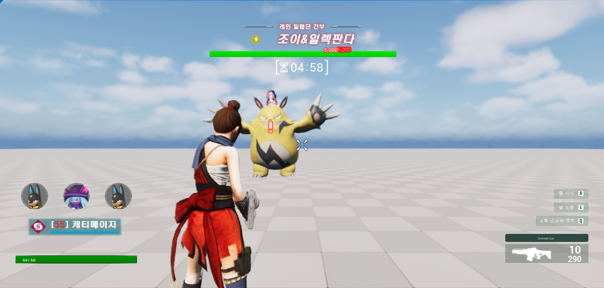
</p>

---

## 👥 협업 파트 요약

- **플레이어 시스템 (최정선)**: 캐릭터 기본 기동, 총기 사격 메커니즘, 펠 소환 인터페이스 제어
- **펠 시스템 (Justin)**: 아누비스/캐티메이지 펠 소환체 AI 패턴 설계 및 고유 스킬 구현
- **레벨 디자인 (김소연)**: 보스전 아레나 레벨 및 연출 환경 기획, 콜리전 볼륨 배치
<p align="center">
  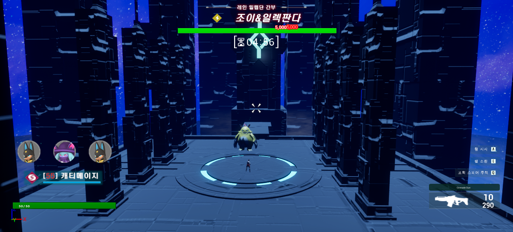
  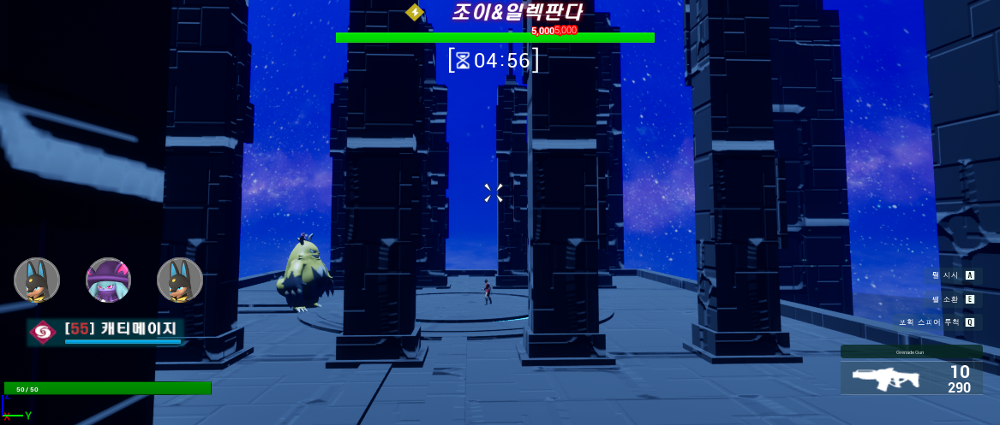
  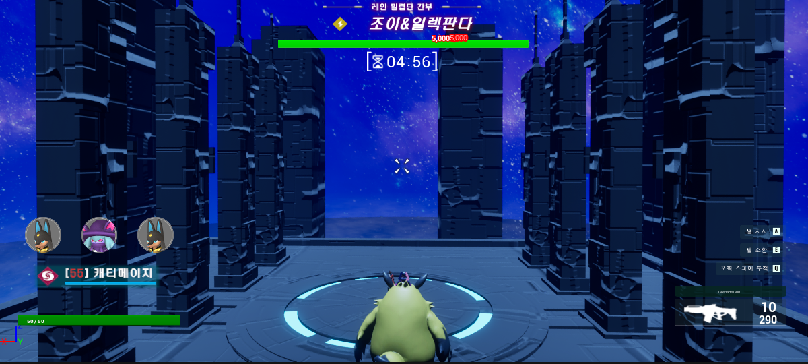
</p>

- **기획 및 발표 (최요한)**: 보스 패턴 기획 및 타임라인 연출 리소스 관리, 최종 프레젠테이션

---

## 🛠️ 사용 기술 및 디테일

- **Unreal Engine 5 / C++ / Blueprint**
- **Animation Notify / Notify State**: 몽타주 타임라인에 커스텀 노티파이를 연동하여 이펙트 스폰 타이밍 및 판정 프레임 제어
<p align="center">
  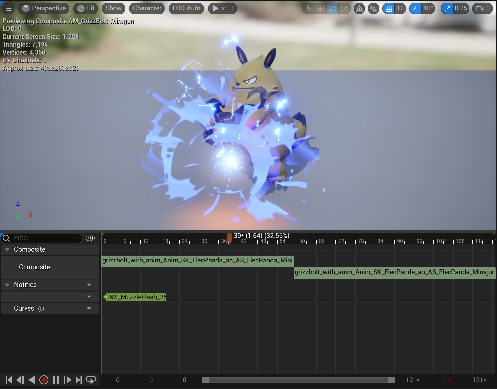
</p>
